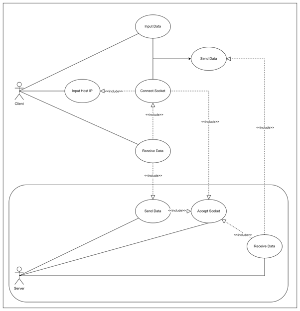
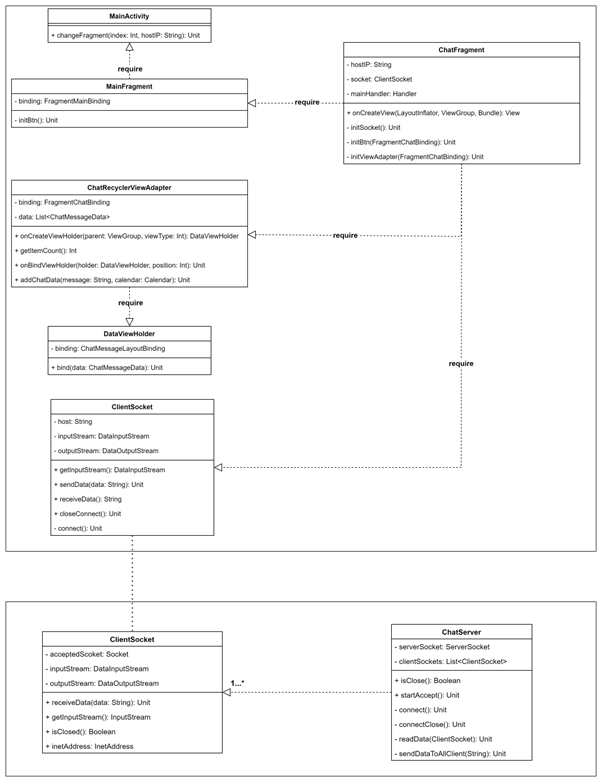
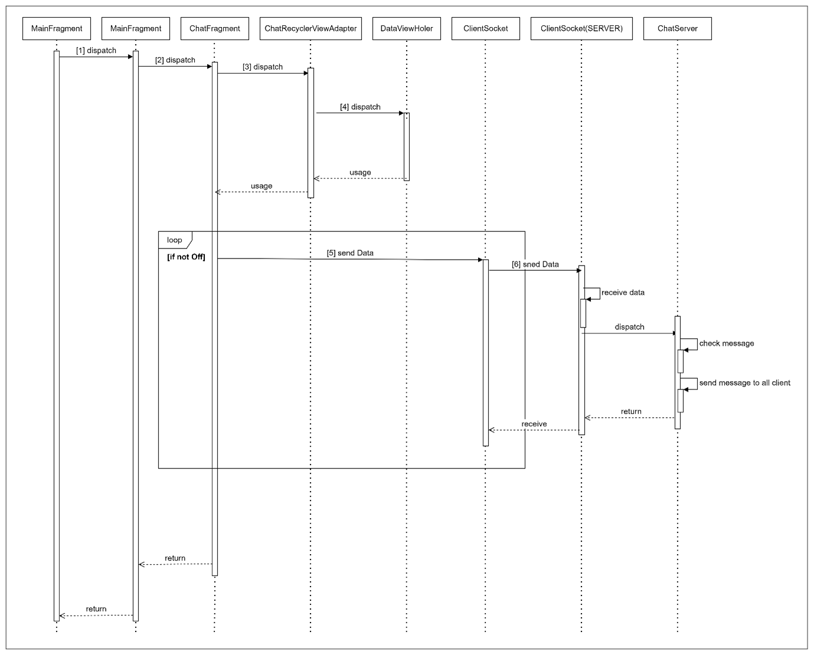

# 💻 Kotlin-SocketChat-Client
Socket을 이용한 kotlin client mobile application

## 🛠 Specification
- IDE: android studio
- min SDK 27
- jetpack component
- kotlin version 17

## 📢 How to use
- 실행 후 server host IP 입력
- port number 8082 사용(기본)
- 채팅 시작

### ClientSocket.class
`ClientSocket`이 server측과 socket 통신

### ChatFragment.class
`RecyclerView` 내에서 채팅 가능

### FileListFragment.class
- 기능구현 중
- server로부터 파일 업로드/다운로드 기능

## 📜 USE CASE

## 📜 Class Diagram

## 📜 Sequence Diagram
